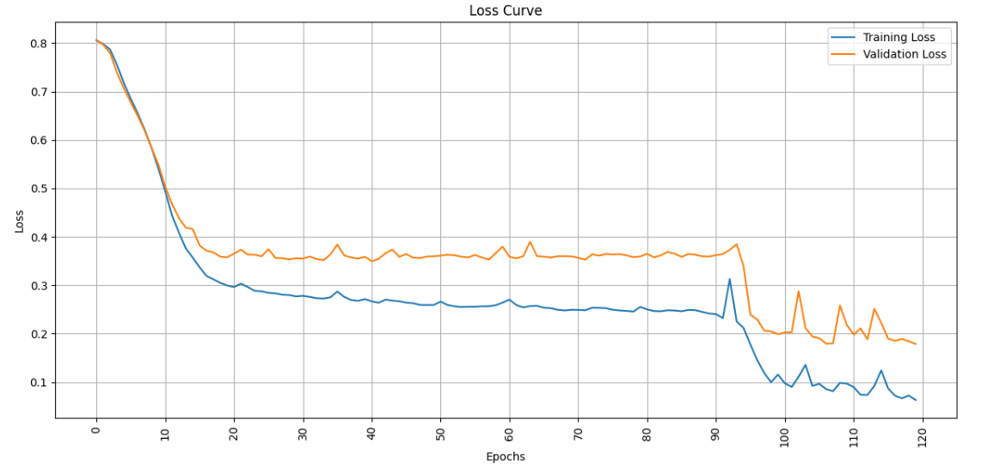
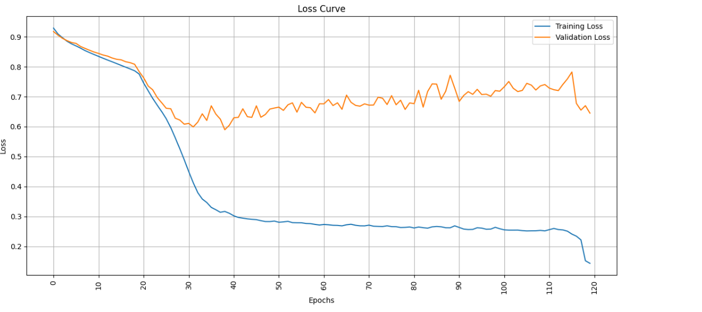
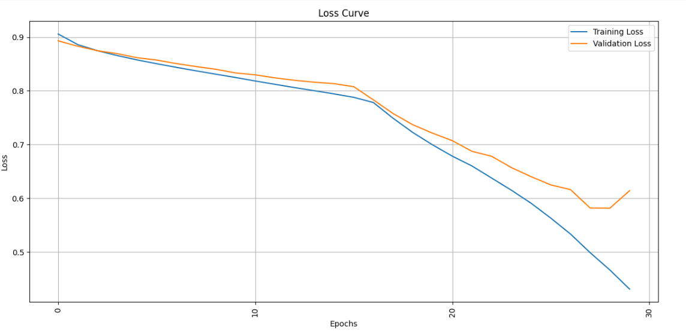
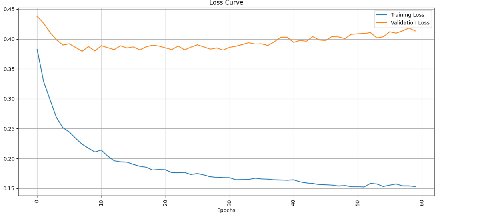
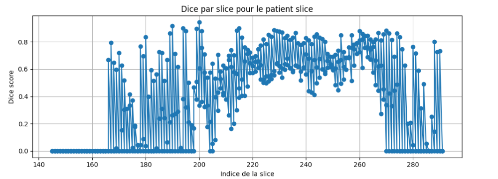
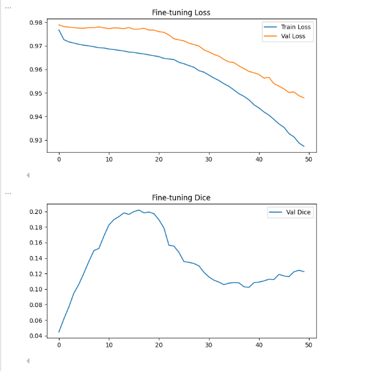
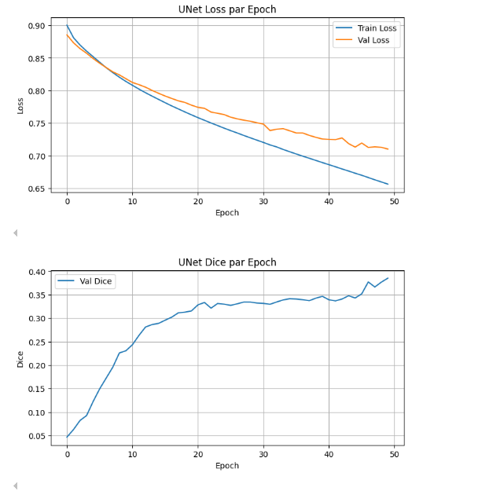
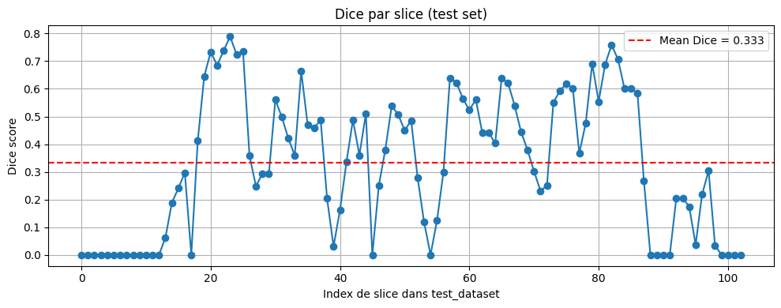

# SEP_segmentation
Si on veut utiliser le venv : 
```venv310\Scripts\activate```

## Traitement des données
Pour lancer le traitement de donnée sans une fonction de traitement parmis celles ci :
```python
steps = [
    "correction_n4",
    "extraction_cerveau",
    "lecture_ants",
    "registration",
    "warp_masque",
    "application_masque",
    "sauvegarde"
]
```
Faites la commande : 
```sh
python .\traitement_data.py --skip=correction_n4,..
```

## Architecture des données 

Il y a différentes approches d'apprentissage, et cela passe aussi par la structuration de nos données d'entré.

* Structure __Flat__ :
```
output/
├── images/
│   ├── 0000.png
│   ├── 0001.png
├── masks/
    ├── 0000.png
    ├── 0001.png

```
Tout les patients ensemble

* Structure __Per Patient__ :
```
output/
├── patient_001/
│   ├── IRM/
│   │   ├── slice_000.png
│   └── masque/
│       ├── slice_000.png
├── patient_002/
│   ├── IRM/
│   └── masque/
```

* Structure du __UNext__ : 
```
output/
├── images/
│   ├── 0000.png
├── masks/
    └── 1/
        ├── 0000.png
```
Similaire au __flat__, cette fois ci, les mask sont ségmenté par label, dans notre que de la SEP, il n'y a que le masque des laisions.

Pour lancer le script : 

```sh
python slicer.py `
  --data_dir data `
  --output_dir outputs/SEP `
  --orientation axial `
  --structure unext `
  --size 512 512 `
   --max_empty_ratio 0.2 # si pas def => pas de max
```


# Resultats
## On train le UNet avec 500 epochs


On obtient les résulat suivant pour la __best epoch__, étant le point où __la valid loss est la plus faible__ :
* Dice (MONAI) : 0.899
* IoU  (MONAI) : 0.816
* Dice (NumPy) : 0.899
* IoU  (NumPy) : 0.816

## On train le UNet avec 120 epochs



Cette fois ci le __best epoch__ est le point ou __la difference valid loss et train loss est la plus faible__
On a donc la __best epoch = 93__, et les résultats suivant :
* Dice (MONAI) : 0.897
* IoU  (MONAI) : 0.813
* Dice (NumPy) : 0.897
* IoU  (NumPy) : 0.813

On constate que le résultat de Dice varient peut par rapport à __epoch = 500__. Néanmoins on peut espérer une généralisation meilleur.

## Nouvel segmentation des dataset (suite échange avec la prof):



Dice (MONAI) : 0.2536
IoU  (MONAI) : 0.1913
Dice (NumPy) : 0.2536
IoU  (NumPy) : 0.1913
📸 Meilleure image (Dice NumPy) : 0.8820



Dice (MONAI) : 0.2581
IoU  (MONAI) : 0.1785
Dice (NumPy) : 0.2581
IoU  (NumPy) : 0.1785
📸 Meilleure image (Dice NumPy) : 0.9000

les résultat sont toujours __très mauvais__.

## On constate que beaucoup de patient possède un tres grand nombre de mask vide (sans laision), le modèle aprends trop à prédire "vide"

Voici la proportion initial de slice ayant des anotartions "vides". C'est trop.

| Patient     | Slices vides | Total slices | Proportion vide |
|-------------|---------------|----------------|------------------|
| 01016SACH   | 17            | 147            | 11.56%           |
| 01038PAGU   | 17            | 147            | 11.56%           |
| 01039VITE   | 23            | 147            | 15.65%           |
| 01040VANE   | 110           | 147            | 74.83%           |
| 01042GULE   | 54            | 147            | 36.73%           |
| 07001MOEL   | 64            | 147            | 43.54%           |
| 07003SATH   | 19            | 147            | 12.93%           |
| 07010NABO   | 80            | 147            | 54.42%           |
| 07040DORE   | 58            | 147            | 39.46%           |
| 07043SEME   | 57            | 147            | 38.78%           |
| 08002CHJE   | 30            | 147            | 20.41%           |
| 08027SYBR   | 66            | 147            | 44.90%           |
| 08029IVDI   | 31            | 147            | 21.09%           |
| 08031SEVE   | 46            | 147            | 31.29%           |
| 08037ROGU   | 3             | 147            | 2.04%            |

On supprimer l'excedant de slice ayant des anotations "vides" :

| Patient     | Slices vides | Total slices | Proportion vide |
|-------------|---------------|----------------|------------------|
|train|
| 01039VITE   | 23            | 147            | 15.65%           |
| 07001MOEL   | 64            | 147            | 43.54%           |
| 07003SATH   | 19            | 147            | 12.93%           |
| 07010NABO   | 80            | 147            | 54.42%           |
| 07040DORE   | 2             | 91             | 2.20%            |
| 07043SEME   | 0             | 90             | 0.00%            |
| 08029IVDI   | 0             | 116            | 0.00%            |
| 08031SEVE   | 0             | 101            | 0.00%            |
| 08037ROGU   | 0             | 144            | 0.00%            |
|val|
| 01040VANE   | 42            | 79             | 53.16%           |
| 01042GULE   | 0             | 93             | 0.00%            |
| 08027SYBR   | 0             | 81             | 0.00%            |
|test|
| 01016SACH   | 17            | 147            | 11.56%           |
| 01038PAGU   | 17            | 147            | 11.56%           |
| 08002CHJE   | 30            | 147            | 20.41%           |


Avec ces changements j'ai train : 

la best epoch est 37

et eu ces resultats : 

Dice (MONAI) : 0.4524
IoU  (MONAI) : 0.3432
Dice (NumPy) : 0.3868
IoU  (NumPy) : 0.2934


## On analyse lévolution du score de dice en fonction des slices : 




## Premier resultart concluant du UNeXt :
IoU: 0.1786
Dice: 0.1786

## Fine-tunning Model VS Unet classique [NULL]

comparaison avec meme nomnbre de patient annotés

avec fine tuning
=> dans ce cas là, nous avions entrainé un Auto Encodeur avec des donnée non anoté
=> puis train un Unet héritant des poids du AE (en figant certaines couches)


unet basique 


## Fine Tunning Model [SUCESS]
Pour le train de chacun de ses models, non répartissons les fichier de la façon suivante :
```
train + validation => 4 patient (train ~ 0.75 et validation ~ 0.25)
``` 
#### Pour le model fine tuné
nbr_epoch = 50
__Score dice =0.33__ 



#### Pour le model Unet basique
nbr_epoch = 50
__Score dice =0.17__ 
