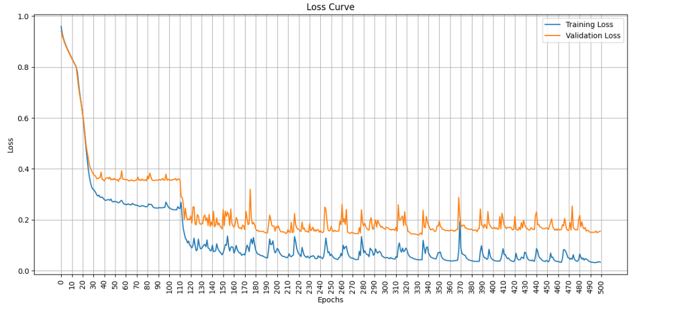

# SEP_segmentation

## Traitement des données
Pour lancer le traitement de donnée sans une fonction de traitement parmis celles ci :
```python
steps = [
    "correction_n4",
    "extraction_cerveau",
    "lecture_ants",
    "registration",
    "warp_masque",
    "application_masque",
    "sauvegarde"
]
```
Faites la commande : 
```sh
python .\traitement_data.py --skip=correction_n4,..
```

## Architecture des données 

Il y a différentes approches d'apprentissage, et cela passe aussi par la structuration de nos données d'entré.

* Structure __Flat__ :
```
output/
├── images/
│   ├── 0000.png
│   ├── 0001.png
├── masks/
    ├── 0000.png
    ├── 0001.png

```
Tout les patients ensemble

* Structure __Per Patient__ :
```
output/
├── patient_001/
│   ├── IRM/
│   │   ├── slice_000.png
│   └── masque/
│       ├── slice_000.png
├── patient_002/
│   ├── IRM/
│   └── masque/
```

* Structure du __UNext__ : 
```
output/
├── images/
│   ├── 0000.png
├── masks/
    └── 1/
        ├── 0000.png
```
Similaire au __flat__, cette fois ci, les mask sont ségmenté par label, dans notre que de la SEP, il n'y a que le masque des laisions.

Pour lancer le script : 

```sh
python slicer.py `
  --data_dir data `
  --output_dir outputs/SEP `
  --orientation axial `
  --structure unext `
  --size 512 512
```


# Resultats
## On train le UNet avec 500 epoch

